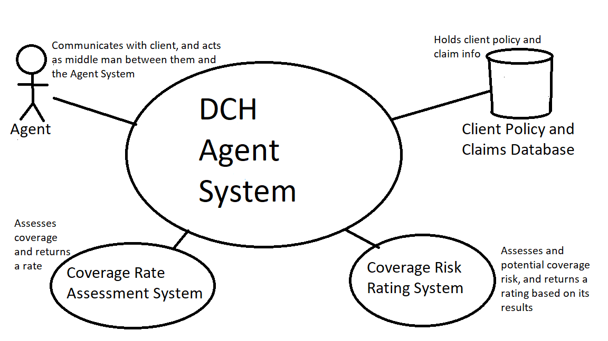

# DCH Agent System

### Description
This system will enable agents to review, organize, and modify customers claims and policies, as well as file claims, create new policies, add new customers, and streamline and centralize those processes to one system; without direct interaction between it and clients.

### Requirements
* For agents use only
* Can create new customers
* Can issue policies
* Should return a proposed policy cost to the agent
* Review policies and prior claims
* File claims
* Issue up front fees for new policies

### Actors
* Agents
* Client Policy and Claims Database
* Coverage Risk Rating System
* Coverage Rating Assessment System

### System Context

### [Use Cases](./UseCases.md)

### [Issues List](./IssuesList.md)

### [Glossary](./Glossary.md)